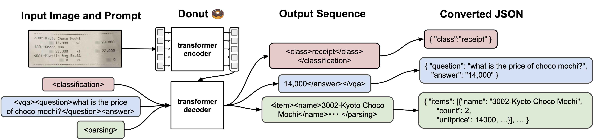

# donut-tutorial

Donut 🍩 : Document Understanding Transformer

Introduction
Donut 🍩, Document understanding transformer, is a new method of document understanding that utilizes an OCR-free end-to-end Transformer model. Donut does not require off-the-shelf OCR engines/APIs, yet it shows state-of-the-art performances on various visual document understanding tasks, such as visual document classification or information extraction (a.k.a. document parsing). In addition, we present SynthDoG 🐶, Synthetic Document Generator, that helps the model pre-training to be flexible on various languages and domains.

Our academic paper, which describes our method in detail and provides full experimental results and analyses, can be found here:

OCR-free Document Understanding Transformer.
Geewook Kim, Teakgyu Hong, Moonbin Yim, JeongYeon Nam, Jinyoung Park, Jinyeong Yim, Wonseok Hwang, Sangdoo Yun, Dongyoon Han, Seunghyun Park. In ECCV 2022.

image

